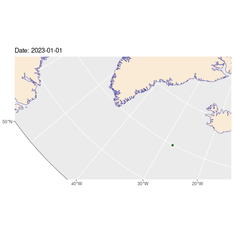

```{r setup, include=FALSE, message=FALSE, warning=FALSE}
knitr::opts_chunk$set(echo = TRUE)
```

> Want to see the code? Click on the black boxes on the right to show/hide the code. 

This is an extension of [yesterday's map](./11-arctic.html) - this time we're going to
show how one of the buoys moved over the course of the year.

```{r data, message=FALSE, warning=FALSE, results='hide'}
#First, we'll need to load a bunch of libraries so we can handle and view geospatial data
library(sf)
library(dplyr)
library(ggplot2)
library(gganimate)
library(terra)

# Open the raw data file and add a couple of columns to make it easier to work with
# We're just interested in one date per day, so we'll remove any duplicates
buoysRaw <- read.csv('./data/11/LEVEL1_2023.csv') 
buoysRaw$id = as.character(buoysRaw$BuoyID)
buoysRaw$dt = as.POSIXct(sprintf("2023-%d-%d 00:00:00", buoysRaw$Month, buoysRaw$Day), format="%Y-%m-%d %H:%M:%S", tz="UTC")

# Filter the data to just the buoy we're interested in and convert it to a spatial object
buoys <- buoysRaw[buoysRaw$id=="300234067976260" ,] %>%
  st_as_sf(coords = c("Lon", "Lat"), crs = 4326) %>%
  st_transform(crs=3995)

# Remove any duplicate dates
buoys <- buoys[!duplicated(buoys$dt),]

# Load the world borders shapefile and crop it to the area we're interested in
wrld_simpl <- st_read('./data/11/TM_WORLD_BORDERS-0.2.shp', quiet = TRUE) 
box = c(xmin = -180, ymin = 45, xmax = 180, ymax = 90)
sf::sf_use_s2(FALSE)
a = st_crop(wrld_simpl, box)
sf::sf_use_s2(TRUE)

# Convert it to the same projection as the buoy data
w_sf <- a %>%
  st_as_sf(coords = c("long", "lat"), crs = 4326) %>%
  st_transform(st_crs(3995))

# Create a border and frame for the map to make it look nice
border <- cbind(x = 0:360, y = rep(50, 361)) %>% st_linestring() %>%  
    st_sfc(crs = 4326) %>% st_transform(st_crs(3995)) 

frame <- list(cbind(x = c(0:360, 360:0, 0), y = c(rep(50, 361), c(rep(0,361)), 50))) %>% st_polygon %>%  
    st_sfc(crs = 4326) %>% st_transform(st_crs(3995)) 
```

## The Map

Here's a map showing the locations of buoy 300234067976260.

```{r map, fig.asp = 1, fig.width = 10, out.width = "100%", message=FALSE, warning=FALSE, results='show'}

# Centre the map on the bounds of the points and
# add a bit of padding so the points aren't right on the edge
width = ext(buoys)$xmax - ext(buoys)$xmin
height = ext(buoys)$ymax - ext(buoys)$ymin

width = max(width,height)

xmin = ext(buoys)$xmin - (width*0.3) 
xmax = ext(buoys)$xmax + (width*0.3)
ymin = ext(buoys)$ymin - (height*0.3)
ymax = ext(buoys)$ymax + (height*0.3)


# Create the map by adding the borders, the world map, the frame and the buoy data
p <- ggplot() +
  geom_sf(data = border, col="darkgrey") +
  geom_sf(data = w_sf, fill= "antiquewhite", color="darkblue")+
  geom_sf(data = frame, col="black", fill="white") +
  geom_sf(data = buoys, color="darkgreen") +
  coord_sf(xlim = c(xmin, xmax), ylim = c(ymin, ymax), crs = sf::st_crs("EPSG:3995")) +
  transition_time(buoys$dt) + labs(title = "Date: {frame_time}") + shadow_wake(0.05, size = 2, alpha = TRUE, wrap = FALSE, falloff = 'sine-in', exclude_phase = 'enter') +
  theme(axis.line = element_blank(),panel.grid.major = element_blank(), panel.grid.minor = element_blank(), panel.border = element_blank(), panel.background = element_rect(fill = "aliceblue"))
# to render the animation you can either output p which will generate a bunch of images that you can convert
# to an animated gif, or you use the animate command, which is slower.
#animate(p +   transition_time(buoys$dt) + labs(title = "Year: {frame_time}"), nframes = nrow(buoys))
```



### Credits

Buoy data from the International Arctic Buoy Programme (IABP): https://iabp.apl.uw.edu/data.html

Map data from the World Wind Java project: https://github.com/nasa/World-Wind-Java/blob/master/WorldWind/testData/shapefiles/TM_WORLD_BORDERS-0.2Readme.txt    
