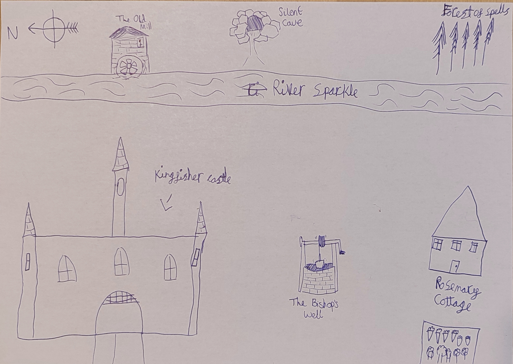

We always say that you can judge a good book by the quality of its map. So we decided
to put together a map that might appear in the front of a good book. This map was created
by members of our family!

### Credits
