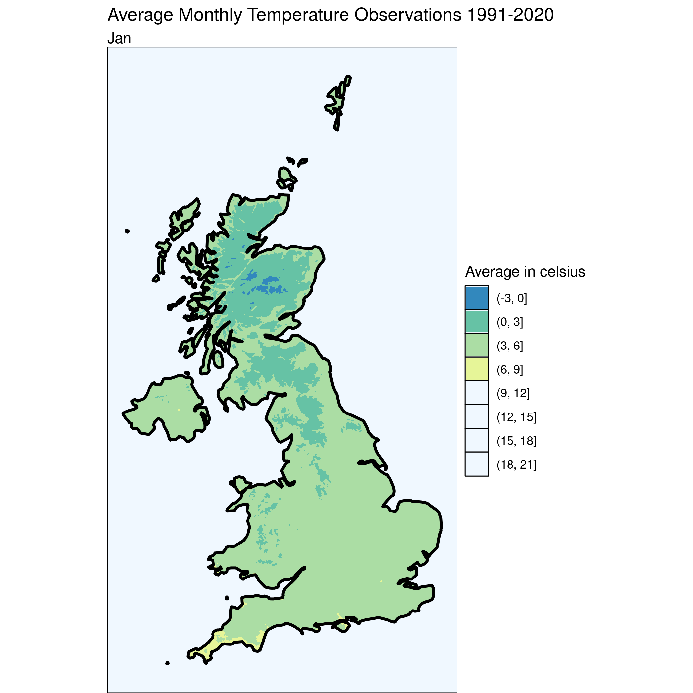
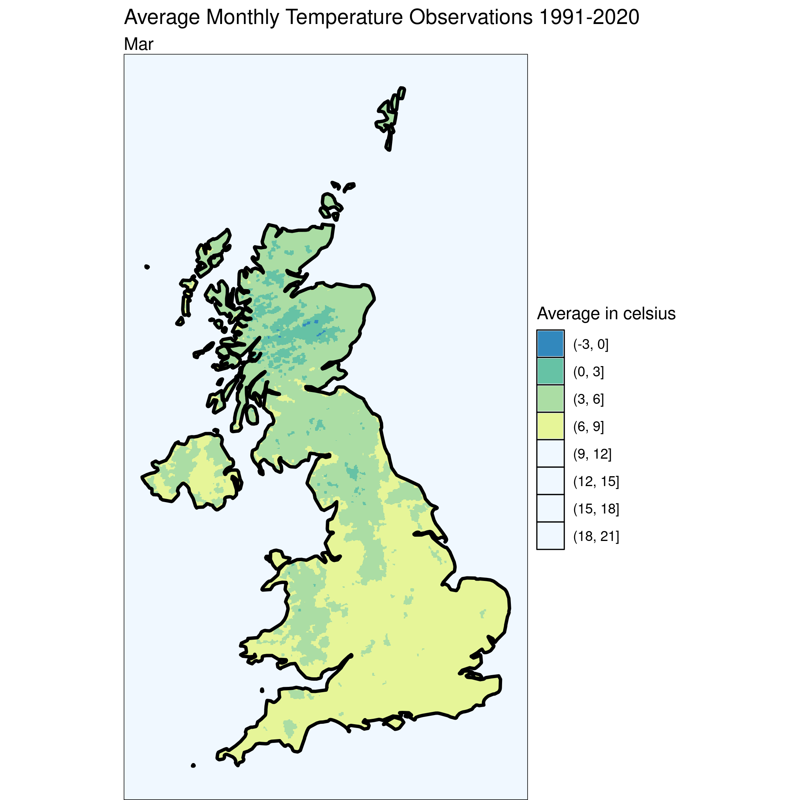
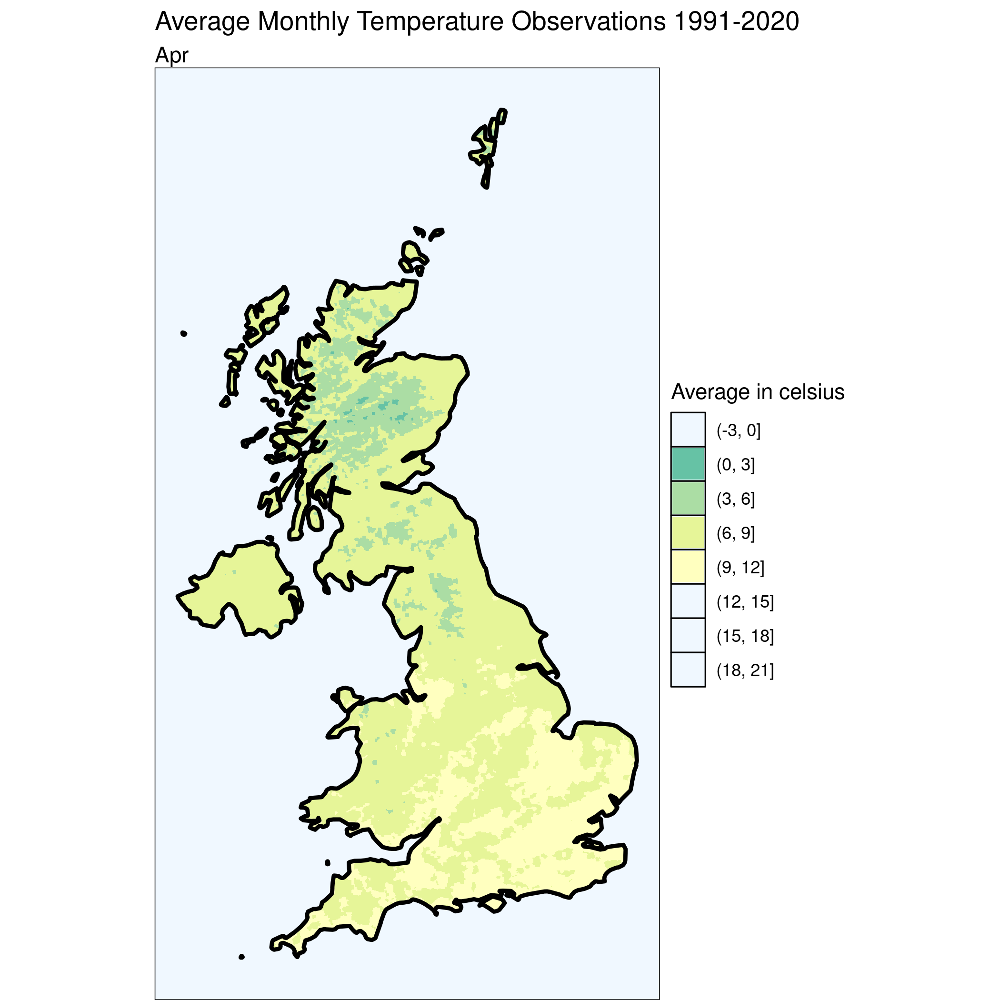
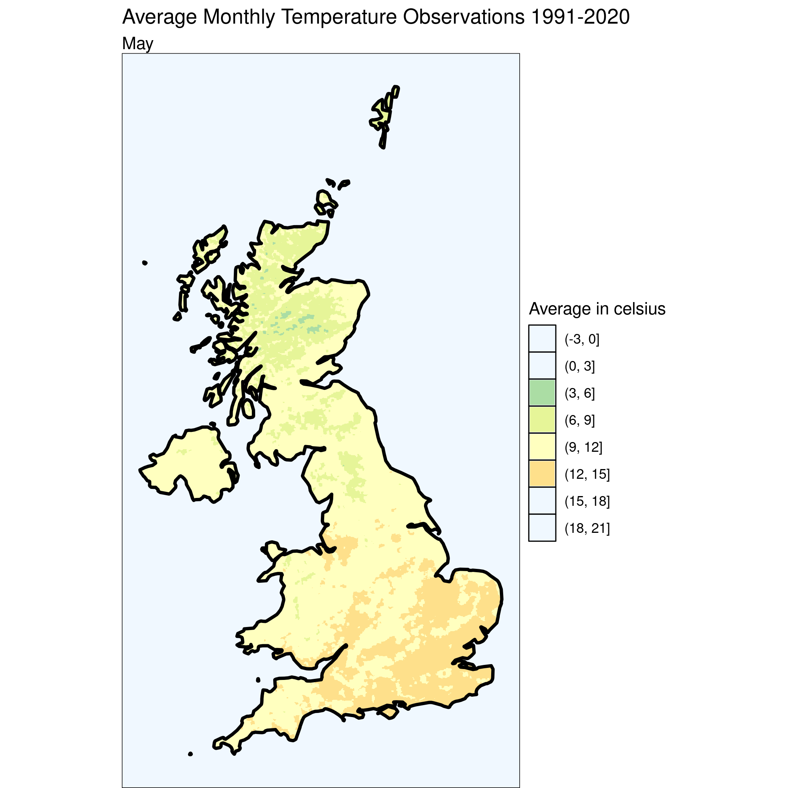
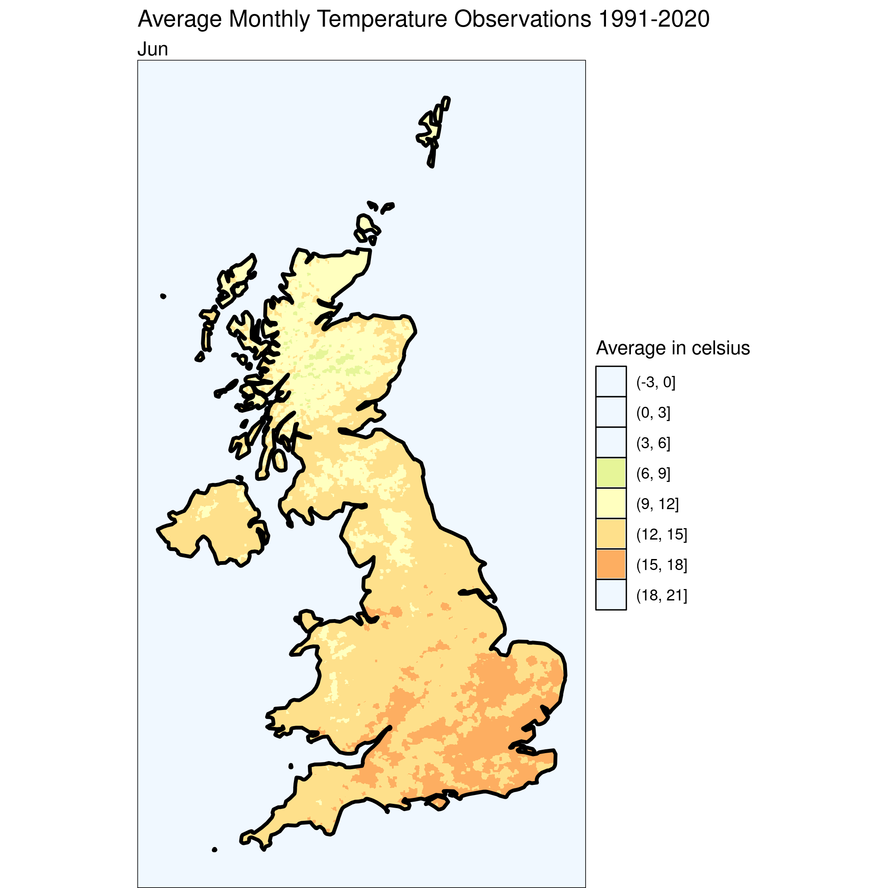
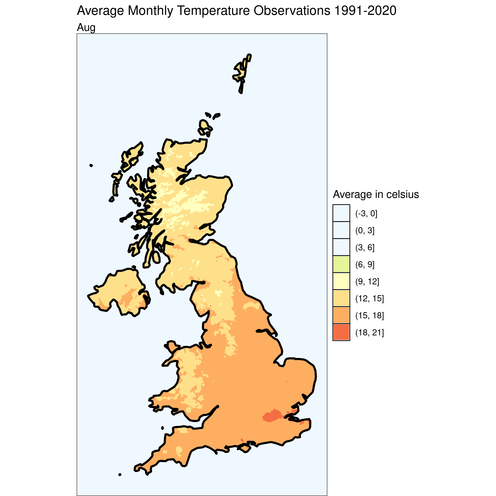
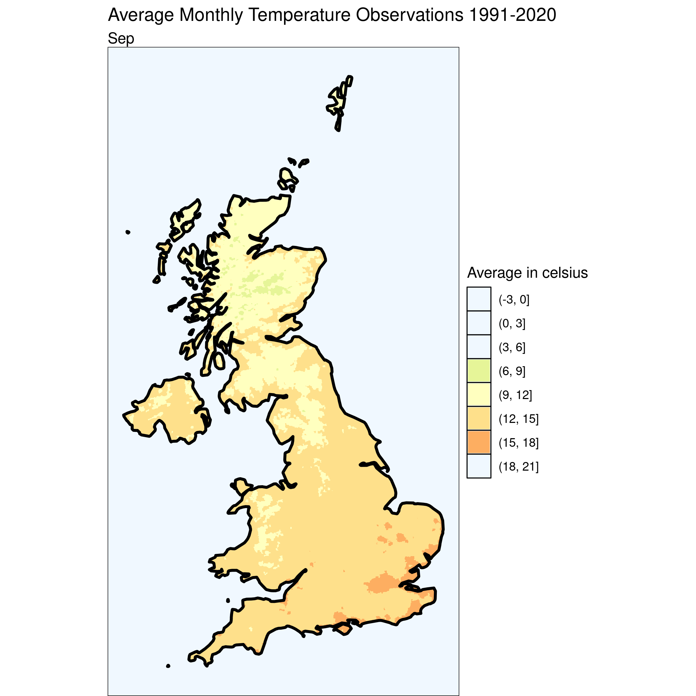
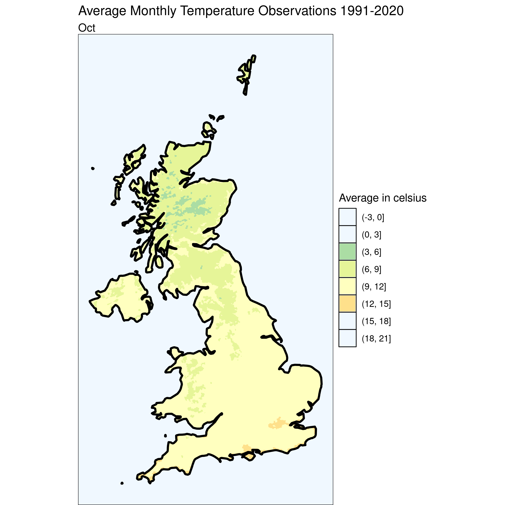

```{r setup, include=FALSE, message=FALSE, warning=FALSE}
knitr::opts_chunk$set(echo = TRUE)
```

> Want to see the code? Click on the black boxes on the right to show/hide the code. 

# Heat

Today we have a series of maps showing the average monthly temperature observations for the UK between 1991 and 2020. The
maps show the average temperature as a contour plot, also known as a filled iso-thermal map. The maps are created using the HadUK-Grid gridded and regional land surface climate observation datasets available from the UK Met Office.


```{r data, message=FALSE, warning=FALSE, results='show'}
#First, we'll need to load a bunch of libraries so we can handle and view geospatial data
library(sf)
library(dplyr)
library(ggplot2)
require(akima)
require(RColorBrewer)

# Load the temperature data
temp <- st_read('./data/25/Monthly_Temperature_Observations_1991-2020.shp', quiet=TRUE) %>% st_transform(crs=27700)

# Calculate the centroid of each grid cell
temp$x <- st_coordinates(st_centroid(temp))[,1] 
temp$y <- st_coordinates(st_centroid(temp))[,2] 

# We'll also need the UK boundary to clip the data
uk_boundary <- st_read('./data/11/TM_WORLD_BORDERS-0.2.shp', quiet = TRUE) %>% st_transform(crs = 27700) %>% filter(NAME == "United Kingdom")

i <- 0

# Set up the legend breaks and color palette
breaks = seq(-3, 21, by = 3)
palette <- brewer.pal(n = length(breaks), name = "Spectral")

# Loop through each month and create a isothermal map
# c("tasJan", "tasFeb", "tasMar", "tasApr", "tasMay", "tasJun", "tasJul", "tasAug", "tasSep", "tasOct", "tasNov", "tasDec") %>% purrr::walk(function(month) { 
# 
#   # Extract the current month
#   temp$curMonth = temp[[month]]
# 
#   # Interpolate the data to create a grid 
#   grid <- akima::interp(temp$x, temp$y, temp$curMonth, duplicate="strip", nx=500, ny=2500)
#   griddf <- data.frame(x = rep(grid$x, ncol(grid$z)), 
#                        y = rep(grid$y, each = nrow(grid$z)), 
#                        z = as.numeric(grid$z))
#   
#   # Convert the grid to a spatial object and crop it to the UK boundary
#   grid_as_sf <- st_as_sf(griddf, coords = c("x", "y"), crs=27700)
#   cropped_grid <- st_intersection(st_cast(grid_as_sf), st_union(uk_boundary)) 
#   cropped_grid$x <- st_coordinates(st_centroid(cropped_grid))[,1] 
#   cropped_grid$y <- st_coordinates(st_centroid(cropped_grid))[,2]
# 
#     # Create a contour plot
#   ggplot() +
#     geom_contour_filled(data=cropped_grid, mapping=aes(x, y, z=z), breaks=breaks)+
#     scale_fill_manual('Average in celsius', values = rev(palette),  # set up color palette manually and using decrasing order for values
#                     drop = F) + 
#     geom_sf(data = uk_boundary, fill= "transparent", color="black", linewidth=1)+
#     theme_void() +
#     theme(axis.line = element_blank(),panel.grid.major = element_blank(), panel.grid.minor = element_blank(), panel.border = element_blank(), panel.background = element_rect(fill = "aliceblue")) + 
#     ggtitle("Average Monthly Temperature Observations 1991-2020", subtitle=substr(month, 4, nchar(month)))
#    
#   # Save the plot to a file
#   ggsave(sprintf("./images/heat-%d.png", i))
# 
#   #increment the counter
#   i <<- i + 1
# 
# 
# })


```












### Credits

The HadUK-Grid gridded and regional land surface climate observation datasets are provided under open government licence. https://www.nationalarchives.gov.uk/doc/open-government-licence/version/3/ 
